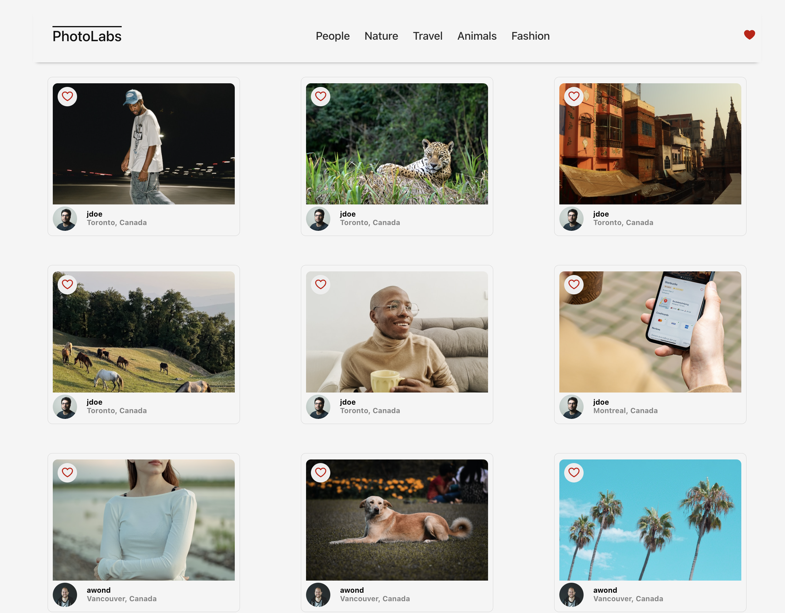
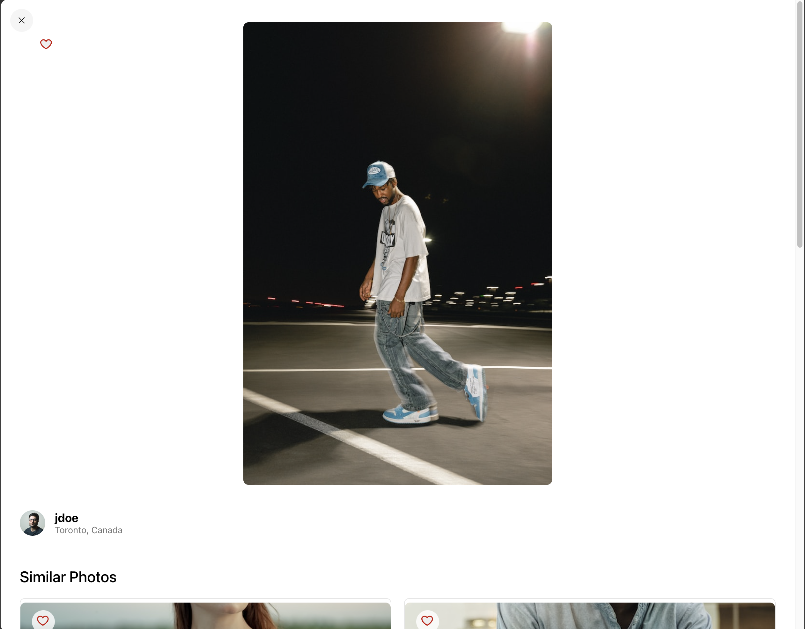

# **Photolabs**

PhotoLabs is a React-based Single Page Application (SPA) that allows users to explore and interact with photos dynamically. This project utilizes React (frontend), Node.js/Express (backend), and PostgreSQL (database) for a complete full-stack approach.

---

# **Project Overview**

## **Goal**

1. Build a client-side application using the React view-layer library.

## **Features**

1. The client-side consists of the development of a React single page application (SPA) called PhotoLabs
2. The server and persistence layer given as follows:
3. The data layer consists of PostgreSQL database
4. The API server consists of a Node Express.js server application
5. The server/persistence layer may require modifications for stretch goals
6. The client will communicate with the API over HTTP using the JSON format

---

# **Tech Stack**

## **Frontend**

1. **React** (UI Library)
2. **Vite** (fast development server)
3. **SCSS** (styling)
4. **ESLint** and Prettier (code linting and formatting)

## **Backend**

1. **Node.js & Express** (server & API)
2. **PostgresSQL** (database)

---

# **Setup**

## **Backend Setup**

[Backend Setup Instructions](/backend/)

1. Navigate to the backend folder:
   ```
   cd backend
   ```
2. Install dependencies:
   ```
   npm install
   ```
3. Configure environment variables (`.env` file):
   ```
   DATABASE_URL=postgres://development@localhost/photolabs_development
   ```
4. Initialize the database:
   ```
   npm run reset
   ```
5. Start the server:
   ```
   npm start
   ```
   The backend will run on **`http://localhost:8001`**.

## **Frontend Setup**

[Frontend Setup Instructions](/frontend/)

1. Navigate to the frontend folder:
   ```
   cd frontend
   ```
2. Install dependencies:
   ```
   npm install
   ```
3. Start the development server:
   ```
   npm run dev
   ```
   The frontend will run on **`http://localhost:3000`**.

---

# **Usage**

## **Interacting with the App**

- Click **topics in the navigation bar** to filter photos.
- Click on a **photo** to open the **PhotoDetailsModal**.
- Click **favorite (heart) button** to add/remove a photo from favorites.
- View **favorite count badge** in the top navigation.

## **Screenshot**

### **Main Page**



### **Modal Display**



### **Favorite Image**


---

## **License**

This project is licensed under the **MIT License**.

---

## **Contact**

For any questions or issues, please open a **GitHub Issue** or contact the project maintainers.
